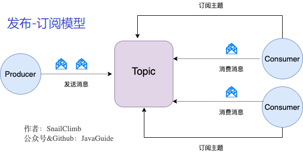

<a name="index">**目录：**</a> 
&emsp;&emsp;<a href="#0">为什么使用 Kafka（消息队列）？</a> 
&emsp;&emsp;<a href="#1">消息队列有什么优点和缺点？</a> 
&emsp;&emsp;<a href="#2">Kafka 的消息模型</a> 
&emsp;&emsp;<a href="#3">什么是Producer、Consumer、Broker、Topic、Partition？</a> 
&emsp;&emsp;<a href="#4">Kafka 的多副本机制了解吗？带来了什么好处？</a> 
&emsp;&emsp;<a href="#5">Kafka 的多分区（Partition）以及多副本（Replica）机制有什么好处呢？</a> 
&emsp;&emsp;<a href="#6">Zookeeper 和 Kafka 的关系</a> 
&emsp;&emsp;<a href="#7">怎么保证消息有序</a> 
&emsp;&emsp;<a href="#8">如何保证不消费重复数据？</a> 
&emsp;&emsp;<a href="#9">怎么保证消息不丢失</a> 
&emsp;&emsp;<a href="#10">重平衡</a> 
&emsp;&emsp;<a href="#11">怎么实现延时消息</a> 
&emsp;&emsp;<a href="#12">消息堆积怎么处理</a> 
&emsp;&emsp;<a href="#13">Kafka 的哪些场景中使用了零拷贝（Zero Copy）？</a> 
&emsp;&emsp;<a href="#14">Kafka 怎么保证高可用</a> 
# <a name="0">为什么使用 Kafka（消息队列）？</a><a style="float:right;text-decoration:none;" href="#index">[Top]</a>

    参考：
        1. [why-mq.md](https://github.com/doocs/advanced-java/blob/main/docs/high-concurrency/why-mq.md#kafkaactivemqrabbitmqrocketmq-%E6%9C%89%E4%BB%80%E4%B9%88%E4%BC%98%E7%BC%BA%E7%82%B9)

    1. 解耦
    2. 异步
    3. 削峰（限流）

# <a name="1">消息队列有什么优点和缺点？</a><a style="float:right;text-decoration:none;" href="#index">[Top]</a>

    优点就是在特殊场景下有其对应的好处，解耦、异步、削峰。
    缺点：
        1. 系统可用性降低
        2. 系统复杂度提高
        3. 一致性问题

# <a name="2">Kafka 的消息模型</a><a style="float:right;text-decoration:none;" href="#index">[Top]</a>

    

    发布订阅模型（Pub-Sub，区别于使用队列的队列模型）使用主题（Topic）作为消息通信载体，类似于广播模式，
    发布者发布一条消息，该消息通过主题传递给所有的订阅者，在一条消息广播之后才订阅的用户则是收不到该条消息的。

    在发布-订阅模型中，如果只有一个订阅者，那它和队列模型就基本是一样的了。
    所以说，发布-订阅模型在功能层面上是可以兼容队列模型的。

    Kafka 采用的就是发布-订阅模型。

# <a name="3">什么是Producer、Consumer、Broker、Topic、Partition？</a><a style="float:right;text-decoration:none;" href="#index">[Top]</a>

    Kafka 将生产者发布的消息发送到 Topic（主题） 中，需要这些消息的消费者可以订阅这些 Topic（主题），如下图所示：

    

    Producer（生产者）:
        产生消息的一方。
    Consumer（消费者）:
        消费消息的一方。
    Broker（代理）:
        可以看作是一个独立的 Kafka 实例。多个 Kafka Broker 组成一个 Kafka Cluster。

    同时，每个 Broker 中又包含了 Topic 以及 Partition 这两个重要的概念：
    Topic（主题）:
        Producer 将消息发送到特定的主题，Consumer 通过订阅特定的 Topic（主题）来消费消息。
    Partition（分区）:
        Partition 属于 Topic 的一部分。
        一个 Topic 可以有多个 Partition，并且同一 Topic 下的 Partition 可以分布在不同的 Broker 上，
        这也表明一个 Topic 可以横跨多个 Broker。

# <a name="4">Kafka 的多副本机制了解吗？带来了什么好处？</a><a style="float:right;text-decoration:none;" href="#index">[Top]</a>

    Kafka 为分区（Partition）引入了多副本（Replica）机制。
    分区（Partition）中的多个副本之间会有一个叫做 leader 的家伙，其他副本称为 follower。
    发送的消息会被发送到 leader 副本，然后 follower 副本才能从 leader 副本中拉取消息进行同步。

    生产者和消费者只与 leader 副本交互。
    可以理解为其他副本只是 leader 副本的拷贝，它们的存在只是为了保证消息存储的安全性。
    当 leader 副本发生故障时会从 follower 中选举出一个 leader，
    但是 follower 中如果有和 leader 同步程度达不到要求的参加不了 leader 的竞选。

# <a name="5">Kafka 的多分区（Partition）以及多副本（Replica）机制有什么好处呢？</a><a style="float:right;text-decoration:none;" href="#index">[Top]</a>

    1. Kafka 通过给特定 Topic 指定多个 Partition, 而各个 Partition 可以分布在不同的 Broker 上,
       这样便能提供比较好的并发能力（负载均衡）。
    2. Partition 可以指定对应的 Replica 数, 这也极大地提高了消息存储的安全性,
       提高了容灾能力，不过也相应的增加了所需要的存储空间。

# <a name="6">Zookeeper 和 Kafka 的关系</a><a style="float:right;text-decoration:none;" href="#index">[Top]</a>

    参考：
        1. [9张图，Kafka为什么要放弃Zookeeper](https://developer.51cto.com/art/202104/658581.htm)
        2. [Kafka面试题总结](https://github.com/yxudong/JavaGuide/blob/master/docs/system-design/distributed-system/message-queue/Kafka%E5%B8%B8%E8%A7%81%E9%9D%A2%E8%AF%95%E9%A2%98%E6%80%BB%E7%BB%93.md)

    Zookeeper 在 Kafka 中的作用：
        1. 注册中心
            包括 broker 注册，topic 注册，consumer 注册元信息
        2. 负载均衡
            broker 向 Zookeeper 进行注册后，生产者根据 broker 节点来感知 broker 服务列表变化，
            这样可以实现动态负载均衡。

    Kafka 怎么跟 Zookeeper 进行交互：
        Kafka 集群中会有一个 broker 被选举为 Controller 负责跟 Zookeeper 进行交互，
        它负责管理整个 Kafka 集群中所有分区和副本的状态。其他 broker 监听 Controller 节点的数据变化。

        Controller 的选举工作依赖于 Zookeeper，选举成功后，Zookeeper会创建一个 /controller 临时节点。

    Zookeeper带来的问题：
        1. 运维复杂度
        2. Controller故障处理
            Kafaka 依赖一个单一 Controller 节点跟 Zookeeper 进行交互，
            如果这个 Controller 节点发生了故障，就需要从 broker 中选择新的 Controller。
            这个过程非常耗时。
        3. 分区瓶颈
            当分区数增加时，Zookeeper 保存的元数据变多，Zookeeper 集群压力变大，
            达到一定级别后，监听延迟增加，给 Kafka 的工作带来了影响。

    Kafka 2.8 版本去除了 Zookeeper，将依赖于 ZooKeeper 的控制器改造成了基于 Kafka Raft 的 Quorm 控制器。

# <a name="7">怎么保证消息有序</a><a style="float:right;text-decoration:none;" href="#index">[Top]</a>

    Kafka 只能保证 Partition(分区) 中的消息有序，而不能保证 Topic 中的消息有序。

    Kafka 中发送一条消息的时候，可以指定 topic，partition，key，data（数据）4 个参数。
    如果发送消息的时候指定了 Partition 的话，所有消息都会被发送到指定的 Partition。
    并且，同一个 key 的消息可以保证只发送到同一个 partition，这个可以采用表/对象的 id 来作为 key。

    总结一下，对于如何保证 Kafka 中消息消费的顺序，有下面两种方法：
        1. 1 个 Topic 只对应一个 Partition。
        2. （推荐）发送消息的时候指定 key/Partition。

# <a name="8">如何保证不消费重复数据？</a><a style="float:right;text-decoration:none;" href="#index">[Top]</a>

    消息投递的可靠保证设置为 At-least-once，同时由业务方来保证，比如通过 Redis，Mysql 唯一索引等等。

# <a name="9">怎么保证消息不丢失</a><a style="float:right;text-decoration:none;" href="#index">[Top]</a>

    todo
    生产者丢失消息的情况：
        采用为发送消息函数添加回调的形式，消息发送失败重试，
        同时把 Producer 的 retries（重试次数）设置为一个比较合理的值。
    消费者丢失消息的情况：
        消息在被追加到 Partition(分区)的时候都会分配一个特定的偏移量（offset）。偏移量（offset)表示 Consumer 当前消费到的 Partition(分区)的所在的位置。Kafka 通过偏移量（offset）可以保证消息在分区内的顺序性。
        当消费者拉取到了分区的某个消息之后，消费者会自动提交了 offset。自动提交的话会有一个问题，试想一下，当消费者刚拿到这个消息准备进行真正消费的时候，突然挂掉了，消息实际上并没有被消费，但是 offset 却被自动提交了。

        解决办法也比较粗暴，我们手动关闭自动提交 offset，每次在真正消费完消息之后之后再自己手动提交 offset 。 但是，细心的朋友一定会发现，这样会带来消息被重新消费的问题。比如你刚刚消费完消息之后，还没提交 offset，结果自己挂掉了，那么这个消息理论上就会被消费两次。

        Kafka 弄丢了消息
    设置 acks = all

    解决办法就是我们设置 acks = all。acks 是 Kafka 生产者(Producer) 很重要的一个参数。

    acks 的默认值即为1，代表我们的消息被leader副本接收之后就算被成功发送。当我们配置 acks = all 代表则所有副本都要接收到该消息之后该消息才算真正成功被发送。

    设置 replication.factor >= 3

    为了保证 leader 副本能有 follower 副本能同步消息，我们一般会为 topic 设置 replication.factor >= 3。这样就可以保证每个 分区(partition) 至少有 3 个副本。虽然造成了数据冗余，但是带来了数据的安全性。

    设置 min.insync.replicas > 1

    一般情况下我们还需要设置 min.insync.replicas> 1 ，这样配置代表消息至少要被写入到 2 个副本才算是被成功发送。min.insync.replicas 的默认值为 1 ，在实际生产中应尽量避免默认值 1。

    但是，为了保证整个 Kafka 服务的高可用性，你需要确保 replication.factor > min.insync.replicas 。为什么呢？设想一下假如两者相等的话，只要是有一个副本挂掉，整个分区就无法正常工作了。这明显违反高可用性！一般推荐设置成 replication.factor = min.insync.replicas + 1。

# <a name="10">重平衡</a><a style="float:right;text-decoration:none;" href="#index">[Top]</a>

    todo

# <a name="11">怎么实现延时消息</a><a style="float:right;text-decoration:none;" href="#index">[Top]</a>

    todo
    只能实现基于队列的延时，不能实现基于时间的延时（也就是任意精度的延时）。

# <a name="12">消息堆积怎么处理</a><a style="float:right;text-decoration:none;" href="#index">[Top]</a>

    参考：
        1. [mq-time-delay-and-expired-failure.md](https://github.com/doocs/advanced-java/blob/main/docs/high-concurrency/mq-time-delay-and-expired-failure.md)

    1. 先修复 consumer 的问题，确保其恢复消费速度，然后将现有 consumer 都停掉。
    2. 新建一个 topic，partition 是原来的 10 倍，临时建立好原先 10 倍的 queue 数量。
    3. 然后写一个临时的分发数据的 consumer 程序，这个程序部署上去消费积压的数据，消费之后不做耗时的处理，
       直接均匀轮询写入临时建立好的 10 倍数量的 queue。
    4. 接着临时征用 10 倍的机器来部署 consumer，每一批 consumer 消费一个临时 queue 的数据。
       这种做法相当于是临时将 queue 资源和 consumer 资源扩大 10 倍，以正常的 10 倍速度来消费数据。
    5. 等快速消费完积压数据之后，得恢复原先部署的架构，重新用原先的 consumer 机器来消费消息。

# <a name="13">Kafka 的哪些场景中使用了零拷贝（Zero Copy）？</a><a style="float:right;text-decoration:none;" href="#index">[Top]</a>

    todo
    https://time.geekbang.org/column/article/246934?utm_source=related_read&utm_medium=article&utm_term=related_read

# <a name="14">Kafka 怎么保证高可用</a><a style="float:right;text-decoration:none;" href="#index">[Top]</a>

    1. 副本机制
    2. 故障自动恢复机制
