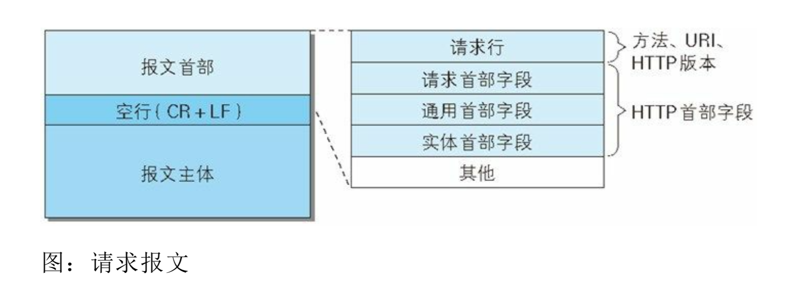
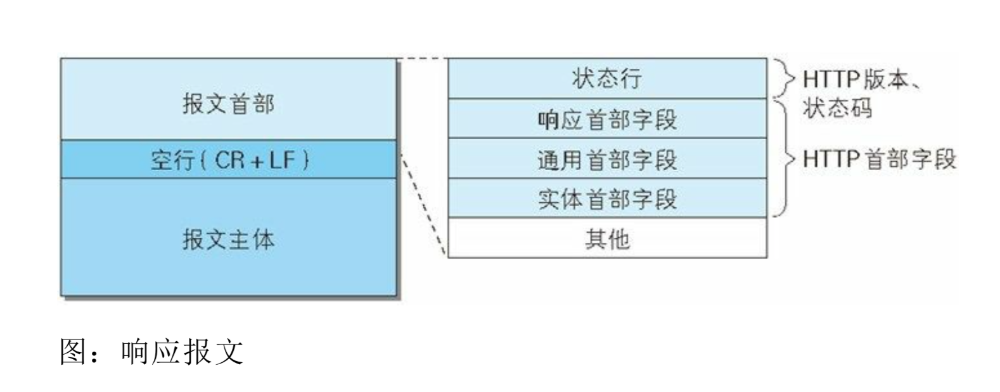
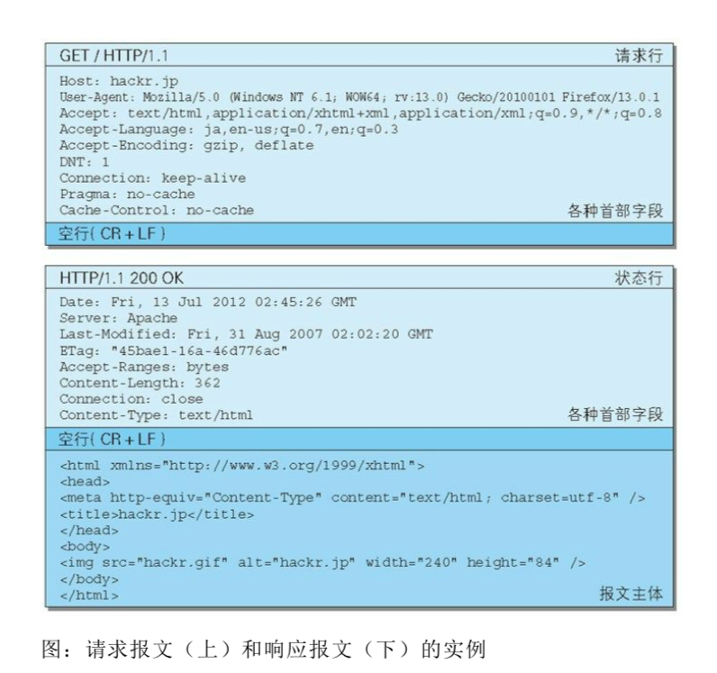
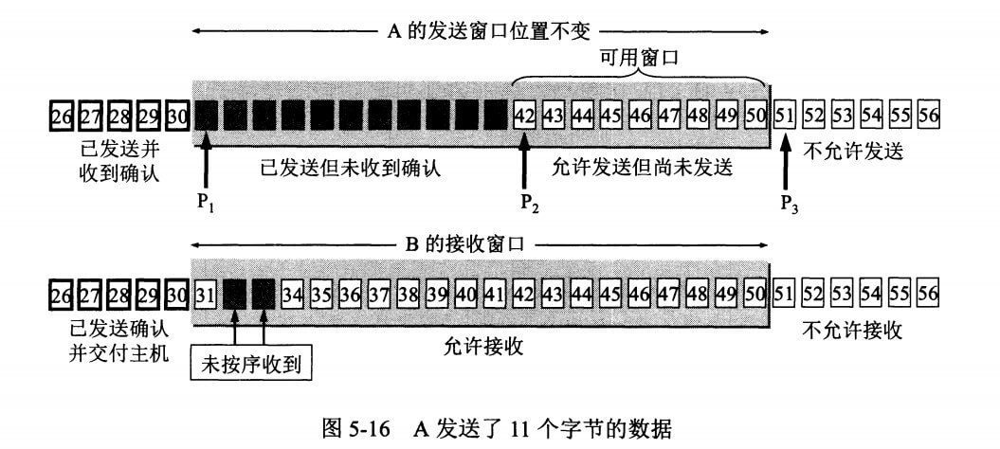
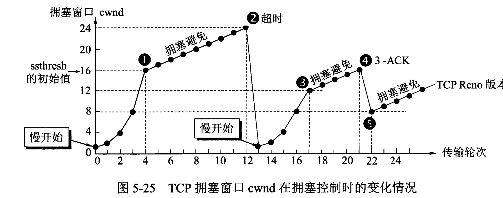

#### HTTP 支持的方法

| 方法名 | 说明 | 支持的 HTTP 协议版本 | 详细说明|
| :---: | :---: | :---: |:---: |
| GET | 获取资源 | 1.0、1.1 | GET 方法用来请求访问已被 URI 识别的资源。指定的资源经服务器端解析后返回响应内容。（我想访问你的某个资源）|
| POST | 传输实体主体 | 1.0、1.1 | POST 方法用来传输实体的主体。虽然 GET 也可以传输实体的主体，但一般不用 GET 而用 POST，POST 的主要目的并不是获取响应的主体内容。（我想把这条信息告诉你）|
| PUT | 传输文件 | 1.0、1.1 | 要求在请求报文的主体中包含文件内容，然后保存到请求 URI 指定位置。（我想要把这份文件传给你）|
| HEAD | 获取报文首部 | 1.0、1.1 | HEAD 方法和 GET 方法一样，只是不返回报文主体部分。用于确认 URI 的有效性及资源更新的日期时间等等（我想要那个相关信息）|
| DELETE | 删除文件 | 1.0、1.1 | 与 PUT 相反的方法，DELETE 方法按请求 URI 删除指定资源（把这份文件删掉吧）|
| OPTIONS | 询问支持的方法 | 1.1 | OPTIONS 用来查询针对请求 URI 指定的资源支持的方法（你支持哪些方法？）|
| TRACE | 追踪路径 | 1.1 | TRACE 方法是让 Web 服务器将之前的请求通信返回给客户端的方法，TRACE 方法不常用，并且容易引发 XST ( Cross-Site-Tracing ，跨站追踪)攻击，所以通常更不会用到了|
| CONNECT | 要求用隧道协议连接代理 | 1.1 | CONNECT 方法要求在与代理服务器通信时建立隧道，实现用隧道协议进行 TCP 通信，主要使用 SSL （ Secure Sockets Layers ，安全套接层）和 TLS （ Transport Layer Security ，传输层安全）协议把通信内容加密后经网络隧道传输|
| PATCH | 更新部分文件内容| 1.1| **当资源存在的时候**，PATCH 用于资源的部分内容的更新，例如更新某一个字段。具体比如说只更新用户信息的电话号码字段，而 PUT 用于更新某个资源较完整的内容，比如说用户要重填完整表单更新所有信息，后台处理更新时可能只是保留内部记录 ID 不变。<br>**当资源不存在的时候**，PATCH 是修改原来的内容，也可能会产生一个新的版本。比如当资源不存在的时候，PATCH 可能会去创建一个新的资源，这个意义上像是 saveOrUpdate 操作。而 PUT 只对已有资源进行更新操作，所以是 update 操作|
| LINK | 建立和资源之间的联系 | 1.0 | ✖︎最新版中已经废弃✖︎|
| UNLINK | 断开连接关系 | 1.0 | ✖︎最新版中已经废弃✖︎|

#### HTTP 方法的幂等和安全性

    HTTP 方法的幂等性是指一次和多次请求某一个资源应该具有同样的副作用。

    HTTP 方法的安全性指的是不会改变服务器状态，也就是说它只是可读的。所以只有 OPTIONS、GET、HEAD 是安全的，其他都是不安全的。

| HTTP 方法 | 幂等性 | 安全性 |
| :---: | :---: | :---: |
|OPTIONS|	yes	|yes|
|GET	|yes	|yes|
|HEAD	|yes	|yes|
|PUT	|yes	|no|
|DELETE	|yes	|no|
|POST	|no	|no|
|PATCH	|no	|no|

    **POST 和 PATCH 这两个不是幂等性的**。
    两次相同的POST请求会在服务器端创建两份资源，它们具有不同的URI。
    对同一URI进行多次PUT的副作用和一次PUT是相同的。

#### HTTP 状态码

| 状态码 | 类别 | 原因短语 |
| :---: | :---: | :---: |
| 1XX | Informational（信息性状态码） | 接收的请求正在处理 |
| 2XX | Success（成功状态码） | 请求正常处理完毕 |
| 3XX | Redirection（重定向状态码） | 需要进行附加操作以完成请求 |
| 4XX | Client Error（客户端错误状态码） | 服务器无法处理请求 |
| 5XX | Server Error（服务器错误状态码） | 服务器处理请求出错 |

    ##### 1XX 信息

    -  **100 Continue** ：表明到目前为止都很正常，客户端可以继续发送请求或者忽略这个响应。

    ##### 2XX 成功

    -  **200 OK** 
    -  **204 No Content**：请求已经成功处理，但是返回的响应报文不包含实体的主体部分。
                           一般在只需要从客户端往服务器发送信息，而不需要返回数据时使用。
    -  **206 Partial Content**：表示客户端进行了范围请求。响应报文包含由 Content-Range 指定范围的实体内容。

    ##### 3XX 重定向

    -  **301 Moved Permanently**：永久性重定向
    -  **302 Found**：临时性重定向
    -  **303 See Other**：和 302 有着相同的功能，但是 303 明确要求客户端应该采用 GET 方法获取资源。
    - 注：虽然 HTTP 协议规定 301、302 状态下重定向时不允许把 POST 方法改成 GET 方法，
          但是大多数浏览器都会在 301、302 和 303 状态下的重定向把 POST 方法改成 GET 方法。
    -  **304 Not Modified**：如果请求报文首部包含一些条件，
                             例如：If-Match，If-ModifiedSince，If-None-Match，If-Range，If-Unmodified-Since，
                             如果不满足条件，则服务器会返回 304 状态码。
    -  **307 Temporary Redirect**：临时重定向，与 302 的含义类似，
                                   但是 307 要求浏览器不会把重定向请求的 POST 方法改成 GET 方法。

    ##### 4XX 客户端错误

    -  **400 Bad Request**：请求报文中存在语法错误。
    -  **401 Unauthorized**：该状态码表示发送的请求需要有认证信息（BASIC 认证、DIGEST 认证）。
                             如果之前已进行过一次请求，则表示用户认证失败。
    -  **403 Forbidden**：请求被拒绝，服务器端没有必要给出拒绝的详细理由。
    -  **404 Not Found**
    -  **405 Method Not Allowed：不允许使用的方法，请求中有一个所请求的 URI 不支持的方法。
                                 响应中应该包含一个 Allow 首部，以告知客户端所请求的资源支持使用哪些方法。

    ##### 5XX 服务器错误

    -  **500 Internal Server Error** ：服务器正在执行请求时发生错误。
    -  **503 Service Unavilable** ：服务器暂时处于超负载或正在进行停机维护，现在无法处理请求。

#### HTTP 报文结构

<p align='center'>

</p>

<p align='center'>

</p>

<p align='center'>

</p>

#### HTTP 并行连接、持久连接、管道化连接

    1. 并行连接
       通过多条 TCP 连接发起并发的 HTTP 请求。
    2. 持久连接
       重用 TCP 连接，以消除连接及关闭的时延。 持久连接（HTTP Persistent Connections），
       也称为 HTTP keep-alive 或者 HTTP connection reuse 。
       在 HTTP/1.1 中，所有的连接默认都是持久连接。要求服务端，客户端都支持持久连接。
    3. 管道化连接 
       通过共享的 TCP 连接发起并发的 HTTP 请求。
       持久连接使得多数请求以管线化（pipelining）方式发送成为可能。
       以前发送请求后需要等待并收到响应，才能发送下一个请求。管线化技术出现后，不用等待响应，直接发送下一个请求。
       比如当请求一个包含 10 张图片的 HTML Web 页面，与挨个连接相比，用持久连接可以让请求更快结束。
       而管线化技术则比持久连接还要快。请求数越多，时间差就越明显。
       因为实现比较复杂，而且会带来线头阻塞问题，所以真正用的并不多。
       线头阻塞问题：若干个请求排队串行化单线程处理，后面的请求等待前面请求的返回才能获得执行机会，
                     一旦有某请求超时等，后续请求只能被阻塞。

#### HTTP/1.0 与 HTTP/1.1 的区别

    1. HTTP/1.1 默认是持久连接
    2. HTTP/1.1 支持管线化处理
    3. HTTP/1.1 支持虚拟主机
    4. HTTP/1.1 新增了状态码
    5. HTTP/1.1 支持分块传输编码
    6. HTTP/1.1 新增缓存处理指令 max-age

#### HTTP/1.0 与 HTTP/1.1 的区别

    1. HTTP/1.1 默认是持久连接
    2. HTTP/1.1 支持管线化处理
    3. HTTP/1.1 支持虚拟主机
    4. HTTP/1.1 新增了状态码
    5. HTTP/1.1 支持分块传输编码
    6. HTTP/1.1 新增缓存处理指令 max-age

#### HTTP/1.1 与 HTTP/2.0 的区别

    1. 二进制分帧
       HTTP/2.0 在应用层（HTTP/2）和传输层（TCP or UDP）之间增加一个二进制分帧层。
       在不改动 HTTP/1.x 的语义、方法、状态码、URI 以及首部字段的情况下，
       解决了 HTTP/1.1 的性能限制，改进传输性能，实现低延迟和高吞吐量。
       在二进制分帧层中，HTTP/2 会将所有传输的信息分割为更小的消息和帧（frame），并对它们采用二进制格式的编码。
       其中 HTTP/1.x 的首部信息会被封装到 HEADER frame，而相应的 Request Body 则封装到 DATA frame 里面。
    2. 多路复用
       HTTP/2.0 使用多路复用技术，同一个 TCP 连接可以处理多个请求。通过给每个帧带上标签的问题解决了线头阻塞。
    3. 首部压缩
       HTTP/1.1 的首部带有大量信息，而且每次都要重复发送。
       HTTP/2.0 对首部进行压缩，要求通讯双方各自缓存一份首部字段表，从而避免了重复传输。
    4. 服务端推送
       HTTP/2.0 在客户端请求一个资源时，会把相关的资源一起发送给客户端，客户端就不需要再次发起请求了。
       例如客户端请求 index.html 页面，服务端就把 index.js 一起发给客户端。
    5. 二进制格式
       HTTP/1.1 的解析是基于文本的，而 HTTP/2.0 采用二进制格式。

#### HTTP/2.0 vs SPDY

    HTTP/2.0 是 SPDY 的升级版（基于SPDY设计），但是，HTTP2.0 跟 SPDY 仍有不同的地方，主要是以下两点：
        1. HTTP/2.0 支持明文 HTTP 传输，而 SPDY 强制使用 HTTPS
        2. HTTP/2.0 消息头的压缩算法采用 HPACK，而非 SPDY 采用的 DEFLATE

#### HTTP/3

    HTTP/3 基于 QUIC 协议实现
    1. HTTP/2.0 虽然解决了线头阻塞的问题，但是 TCP 协议本身就存在阻塞问题，比如某个包丢失，后面的包要等待确认重传，
       所以 HTTP/3 改为使用 UDP 协议。
    2. 关于拥塞控制，TCP 是在内核区实现的，而 HTTP3 将拥塞控制移出了内核，通过用户空间来实现。
       这样做的好处就是不再需要等待内核更新可以实现很方便的进行快速迭代。
    3. HTTPS 使用的 TLS 协议也存在队头阻塞问题。
       QUIC 的传输单元是 Packet，加密单元也是 Packet，整个加密、传输、解密都基于 Packet，这样就能避免 TLS 的队头阻塞问题；

#### HTTPS 流程

    参考：
    https://draveness.me/whys-the-design-https-latency/
    https://blog.csdn.net/xiaopang_yan/article/details/78709574
    https://www.cloudflare.com/zh-cn/learning/ssl/what-happens-in-a-tls-handshake/

    HTTPS 需要 7 次握手（基于 TLS 1.2， TCP 3次，TLS 4 次）
    TLS 1.2 建立连接流程
    1. 客户端向服务端发送 Client Hello 消息，其中携带客户端支持的协议版本、加密算法、压缩算法以及客户端生成的随机数；
    2. 服务端收到客户端支持的协议版本、加密算法等信息后；
        1. 向客户端发送 Server Hello 消息，并携带选择特定的协议版本、加密方法、会话 ID 以及服务端生成的随机数；
        2. 向客户端发送 Certificate 消息，即服务端的证书链，其中包含证书支持的域名、发行方和有效期等信息；
        3. 向客户端发送 Server Key Exchange 消息，传递公钥以及签名等信息；
        4. 向客户端发送可选的消息 CertificateRequest，验证客户端的证书；
        5. 向客户端发送 Server Hello Done 消息，通知服务端已经发送了全部的相关信息；
    3. 客户端收到服务端的协议版本、加密方法、会话 ID 以及证书等信息后，验证服务端的证书（如何验证在下面解释）；
        1. 向服务端发送 Client Key Exchange 消息，包含使用服务端公钥加密后的随机字符串，即预主密钥（Pre Master Secret）；
        2. 向服务端发送 Change Cipher Spec 消息，通知服务端后面的数据段会加密传输；
        3. 向服务端发送 Finished 消息，其中包含加密后的握手信息；
    4. 服务端收到 Change Cipher Spec 和 Finished 消息后；
        1. 向客户端发送 Change Cipher Spec 消息，通知客户端后面的数据段会加密传输；
        2. 向客户端发送 Finished 消息，验证客户端的 Finished 消息并完成 TLS 握手；

    浏览器如何验证证书的合法性？
        浏览器发起 HTTPS 请求时，服务器会返回网站的 SSL 证书，浏览器需要对证书做以下验证：
        1. 验证域名、有效期等信息是否正确。证书上都有包含这些信息，比较容易完成验证；
        2. 判断证书来源是否合法。每份签发证书都可以根据验证链查找到对应的根证书，
           操作系统、浏览器会在本地存储权威机构的根证书，利用本地根证书可以对对应机构签发证书完成来源验证；
        3. 判断证书是否被篡改。需要与 CA 服务器进行校验；
        4. 判断证书是否已吊销。
           通过 CRL（Certificate Revocation List 证书注销列表）和 OCSP（Online Certificate Status Protocol 在线证书状态协议）实现，
           其中 OCSP 可用于第3步中以减少与 CA 服务器的交互，提高验证效率

#### DNS 递归查询和递归查询

    递归查询：一般发生在 Client 请求 DNS Server。Client 发出一个域名解析的请求，
              DNS Server 必须返回对应的 IP 地址，或者返回找不到的错误。
    迭代查询：迭代查询一般发生在 DNS Server 之间，当 Client 发出域名解析的请求后，DNS Server 需要给予最佳答案，
              这个最佳答案可能是"距离最近"的顶级域名服务器，也能是权威域名服务器。
              无论如何，Client 需要对返回结果再次发起请求，知道获得最终结果。

<p align='center'>
    
</p>

#### HTTP 劫持

    在运营商的路由器节点上，设置协议检测，一旦发现是 HTTP 请求，而且是 html 类型请求，则拦截处理。
    常见有两种：
        1. 类似 DNS 劫持返回 302 让用户浏览器跳转到另外的地址(钓鱼网站就是这么干)。
        2. 在服务器返回的 HTML 数据中插入 js 或 dom 节点（广告）（比较常见）。

    解决方法：
        1. 换用 HTTPS（仍然有方法劫持，只不过难度较大）
        2. 向运营商反馈
        3. 在开发的网页中加入代码过滤

#### DNS 劫持

    用户访问一个地址时，DNS 服务器故意将此地址指向一个错误的 IP 地址的行为。
    可能发生在 DNS 解析过程中的各个环节。
    范例，网通、电信、铁通的某些用户有时候会发现自己打算访问一个地址，却被转向了各种推送广告等网站，这就是 DNS 劫持。

    解决方法：
        1. 直接访问 IP 地址
        2. 修改 DNS 服务器地址，绕过被劫持的 DNS 服务器
        3. 使用 HTTP DNS

#### HTTP 劫持和 DNS 劫持区别

    DNS 劫持：在 DNS 服务器中，将 www.xxx.com 的域名对应的 IP 地址进行了变化。解析出来的域名对应的 IP，在劫持前后不一样。
    HTTP 劫持：DNS 解析的域名的 IP 地址不变。
               在和网站交互过程中的劫持了你的请求。在网站发给你信息前就给你返回了请求（通常为添加 js 代码让用户弹出小窗广告）。

#### DNS 污染

    用户访问地址时，服务器通过对 UDP 端口 53 上的 DNS 查询进行入侵检测，
    一经发现与关键词相匹配的请求则立即伪装成 DNS 服务器向用户发回错误的地址的行为。
    范例，国内访问 YouTube、Facebook 之类网站等出现的状况（GEW 原理）。

    解决方法：
        1. 使用 VPN
        2. 修改 Hosts

#### DNS 常见的记录类型

    A 记录：将域名指向一个 IPv4 地址（例如：100.100.100.100），需要增加 A 记录。
    CNAME 记录：如果将域名指向一个域名，实现与被指向域名相同的访问效果，需要增加 CNAME 记录。
                在做 IP 地址变更时要比 A 记录方便。
                CNAME 记录允许将多个名字映射到同一台计算机，当有多个域名需要指向同一服务器 IP 时，
                可以将一个域名做 A 记录指向服务器 IP，然后将其他的域名做别名(即：CNAME)到 A 记录的域名上。
                当服务器 IP 地址变更时，只需要更改 A 记录的那个域名到新 IP 上，
                其它做别名的域名会自动更改到新的 IP 地址，不必对每个域名做更改。
    NS 记录：域名解析服务器记录，用来指定该域名由哪个 DNS 服务器来进行解析。
    MX 记录：建立电子邮箱服务，将指向邮件服务器地址，需要设置 MX 记录。
    TXT记录：可任意填写，可为空，用来备注信息。
    AAAA记录：将主机名（或域名）指向一个 IPv6 地址（例如：ff03:0:0:0:0:0:0:c1），需要添加 AAAA 记录。

#### HTTP DNS

    当客户端需要 DNS 解析的时候，直接通过 HTTP 协议请求服务器，获得 IP 地址，绕过传统的 DNS 解析的过程。

#### DNS 基于 UDP 还是 TCP

    DNS 在区域传输的时候使用 TCP 协议，其他时候使用 UDP 协议。

    DNS 区域传输的时候使用 TCP 协议：
        1.辅域名服务器会定时（一般3小时）向主域名服务器进行查询以便了解数据是否有变动。
          如有变动，会执行一次区域传送，进行数据同步。
          区域传送使用 TCP 而不是 UDP，因为数据同步传送的数据量比一个请求应答的数据量要多得多。
        2.TCP 是一种可靠连接，保证了数据的准确性。

    域名解析时使用 UDP 协议：
        客户端向 DNS 服务器查询域名，一般返回的内容都不超过 512 字节（UDP 报文最大长度），用 UDP 传输即可。
        不用经过三次握手，这样 DNS 服务器负载更低，响应更快。
        理论上说，客户端也可以指定向 DNS 服务器查询时用 TCP，但事实上，很多 DNS 服务器进行配置的时候，仅支持 UDP。

#### TCP 怎么保证可靠传输？

    TCP 使用校验和（主要用于防止数据丢失，保证完整性，不能防止篡改），确认和重传机制来。

#### TCP 怎么保证数据顺序不变和非重复

    TCP 给数据分节进行排序，并使用累积确认保证数据的顺序不变和非重复。

#### TCP 滑动窗口

<p align='center'>
    
</p>

    窗口是缓存的一部分，用来暂时存放字节流。
    发送方和接收方各有一个窗口，接收方通过 TCP 报文段中的窗口字段告诉发送方自己的窗口大小，
    发送方根据这个值和其它信息设置自己的窗口大小。

    发送窗口内的字节都允许被发送，接收窗口内的字节都允许被接收。
    如果发送窗口左部的字节已经发送并且收到了确认，
    那么就将发送窗口向右滑动一定距离，直到左部第一个字节不是已发送并且已确认的状态。

    接收窗口的滑动类似，接收窗口左部字节已经发送确认并交付主机，就向右滑动接收窗口。
 
    接收窗口只会对窗口内最后一个按序到达的字节进行确认，例如接收窗口已经收到的字节为 {31， 32， 34， 35}，
    其中 {31， 32} 按序到达，而 {34， 35} 就不是，因此只对字节 32 进行确认。
    发送方得到一个字节的确认之后，就知道这个字节之前的所有字节都已经被接收。

#### TCP 流量控制

    什么是流量控制？流量控制的目的？
        如果发送者发送数据过快，接收者来不及接收，那么就会有分组丢失。
        为了避免分组丢失，控制发送者的发送速度，使得接收者来得及接收，这就是流量控制。
        流量控制根本目的是防止分组丢失，它是构成TCP可靠性的一方面。

    如何实现流量控制？
        由滑动窗口实现。滑动窗口协议既保证了分组无差错、有序接收，也实现了流量控制。
        主要的方式就是接收方返回的 ACK 中会包含自己的接收窗口的大小，并且利用大小来控制发送方的数据发送。

    流量控制引发的死锁？怎么避免死锁的发生？
        当发送者收到了一个窗口为 0 的应答（表示接收者暂时不能接收数据），发送者便停止发送，等待接收者的下一个应答。
        过了一段时间后，接收者的接收缓存又有了一些存储空间，向发送者发送窗口不为 0 的应答（表示现在可以接收数据了）。
        但是如果这个窗口不为 0 的应答在传输过程丢失，发送者一直等待下去，
        而接收者以为发送者已经收到该应答，等待接收新数据，这样双方就相互等待，从而产生死锁。

        为了避免流量控制引发的死锁，TCP 使用了持续计时器。
        每当发送者收到一个 0 窗口的应答后就启动该计时器。时间一到便主动发送报文询问接收者的窗口大小。
        若接收者仍然返回 0 窗口，则重置该计时器继续等待；若窗口不为0，则表示应答报文丢失了，
        此时重置发送窗口后开始发送，这样就避免了死锁的产生。

#### TCP 拥塞控制

    TCP 主要通过四种算法来进行拥塞控制：慢开始、拥塞避免、快重传、快恢复。
    发送方需要维护一个叫做拥塞窗口（cwnd）的状态变量。
    注意拥塞窗口与发送方窗口的区别，拥塞窗口只是一个状态变量，实际决定发送方能发送多少数据的是发送方窗口。

    1. 慢开始与拥塞避免

<p align='center'>
    
</p>

       发送的最初执行慢开始，令 cwnd=1，发送方只能发送 1 个报文段；
       当收到确认后，将 cwnd 加倍，因此之后发送方能够发送的报文段数量为：2、4、8 ...

       慢开始每个轮次都将 cwnd 加倍，这样会让 cwnd 增长速度非常快，
       从而使得发送方发送的速度增长速度过快，网络拥塞的可能也就更高。
       设置一个慢开始门限 ssthresh，当 cwnd >= ssthresh 时，进入拥塞避免，每个轮次只将 cwnd 加 1。

       如果出现了超时，则令 ssthresh = cwnd/2，然后重新执行慢开始。

    2. 快重传与快恢复

    在接收方，要求每次接收到报文段都应该发送对已收到有序报文段的确认，
    例如已经接收到 M1 和 M2，此时收到 M4，应当发送对 M2 的确认。
    在发送方，如果收到三个重复确认，那么可以确认下一个报文段丢失，例如收到三个 M2 ，则 M3 丢失。
    此时执行快重传，立即重传下一个报文段（为的是使发送方及早知道有报文段没有到达对方，可提高网络吞吐量约 20%）。

    在这种情况下，只是丢失个别报文段，而不是网络拥塞，
    因此执行快恢复，令 ssthresh = cwnd/2 ，cwnd = ssthresh，注意到此时直接进入拥塞避免。

#### 拥塞控制和流量控制的区别

    拥塞控制：拥塞控制是作用于网络的，它是防止过多的数据注入到网络中，避免出现网络负载过大的情况。
              常用的方法就是：（1）慢开始、拥塞避免（2）快重传、快恢复。
    流量控制：流量控制是作用于接收者的，它是控制发送者的发送速度从而使接收者来得及接收，防止分组丢失的。

#### TCP 三次握手

    三次握手是指建立一个 TCP 连接时，需要客户端和服务器总共发送3个包。

    三次握手的目的是连接服务器指定端口，建立 TCP 连接，并同步连接双方的序列号和确认号，交换 TCP 窗口大小信息。
    在 socket 编程中，客户端执行 connect() 时。将触发三次握手。

    1. 第一次握手（SYN=1， seq=x）:
       客户端发送一个 TCP 的 SYN 标志位置 1 的包，
       指明客户端打算连接的服务器的端口，以及初始序号 X，保存在包头的序列号（Sequence Number）字段里。
       序列号的实现目前会随着时间的变化而变化，所以每次建立连接时的序列号都不同。
       发送完毕后，客户端进入 SYN_SEND 状态。

    2. 第二次握手（SYN=1， ACK=1， seq=y， ACKnum=x+1）:
       服务器发回确认包（ACK）应答。即 SYN 标志位和 ACK 标志位均为 1。
       服务器端选择自己 ISN 序列号，放到 Seq 域里，同时将确认序号（Acknowledgement Number）设置为客户的 ISN 加 1，即 X+1。
       发送完毕后，服务器端进入 SYN_RCVD 状态。

    3. 第三次握手（ACK=1，ACKnum=y+1）
       客户端再次发送确认包（ACK），SYN 标志位为 0，ACK 标志位为 1，
       并且把服务器发来 ACK 的序号字段 +1，放在确定字段中发送给对方，并且在数据段放写 ISN 的 +1
       发送完毕后，客户端进入 ESTABLISHED 状态，当服务器端接收到这个包时，也进入 ESTABLISHED 状态，TCP 握手结束。

<p align='center'>
    
</p>

#### 为什么是三次握手

    这是因为在网络请求中，应该时刻记住：“网络是不可靠的，数据包是可能丢失的”。
    假设没有第三次确认，客户端向服务端发送了 SYN，请求建立连接。
    由于延迟，服务端没有及时收到这个包。于是客户端重新发送一个 SYN 包，这两个包的序列号是相同的。

    假设服务端接收到了第二个 SYN 包，建立了通信，一段时间后通信结束，连接被关闭。
    这时候最初被发送的 SYN 包刚刚抵达服务端，服务端又会发送一次 ACK 确认。
    由于两次握手就建立了连接，此时的服务端就会建立一个新的连接，
    然而客户端觉得自己并没有请求建立连接，所以就不会向服务端发送数据。
    从而导致服务端建立了一个空的连接，白白浪费资源。

    在三次握手的情况下，服务端直到收到客户端的应答后才会建立连接。
    因此在上述情况下，客户端会接受到一个相同的 ACK 包，
    这时候它会抛弃这个数据包，不会和服务端进行第三次握手，因此避免了服务端建立空的连接。

#### SYN攻击:

    1. 什么是 SYN 攻击（SYN Flood）？
       在三次握手过程中，服务器发送 SYN-ACK 之后，收到客户端的 ACK 之前的 TCP 连接称为半连接（half-open connect）。
       此时服务器处于 SYN_RCVD 状态。当收到 ACK 后，服务器才能转入 ESTABLISHED 状态.

       SYN 攻击指的是，攻击客户端在短时间内伪造大量不存在的 IP 地址，向服务器不断地发送 SYN 包，
       服务器回复确认包，并等待客户的确认。
       由于源地址是不存在的，服务器需要不断的重发直至超时，这些伪造的 SYN 包将长时间占用未连接队列，
       正常的 SYN 请求被丢弃，导致目标系统运行缓慢，严重者会引起网络堵塞甚至系统瘫痪。

       SYN 攻击是一种典型的 DoS/DDoS 攻击。

    2. 如何检测 SYN 攻击？
       当在服务器上看到大量的半连接状态时，特别是源 IP 地址是随机的，基本上可以断定这是一次 SYN 攻击。
       在 Linux/Unix 上可以使用系统自带的 netstats 命令来检测 SYN 攻击。

        ```http
        # netstat -na TCP | grep SYN_RECV | more，
        ```

    3. 如何防御 SYN 攻击？
       SYN 攻击不能完全被阻止，除非将 TCP 协议重新设计。
       所能做的是尽可能减轻 SYN 攻击的危害，常见的防御 SYN 攻击的方法有如下几种：
       - 过滤网关防护（通过禁止 IP 等）
       - 修改内核参数
         - 减少 net.ipv4.tcp_synack_retries 降低服务器 SYN+ACK 报文重试次数，尽快释放等待资源
         - 增大 tcp_max_syn_backlog，使用服务器的内存资源，换取更大的等待队列长度，
           让攻击数据包不至于占满所有连接而导致正常用户无法完成握手。
         - SYN cookies 技术
           net.ipv4.tcp_syncookies = 1
           SYN Cookie 技术可以让服务器在收到客户端的 SYN 报文时，不分配资源保存客户端信息，
           而是将这些信息保存在 SYN+ACK 的初始序号和时间戳中。
           对正常的连接，这些信息会随着 ACK 报文被带回来。
           通过 Cookie 检验算法鉴定是否与发出去的 SYN+ACK 报文序列号匹配，匹配则通过完成握手，失败则丢弃。


#### TCP 四次挥手
#### TCP 为什么要进行四次挥手？ / 为什么 TCP 建立连接需要三次，而释放连接则需要四次？
#### 为什么 TCP 连接时可以 ACK 和 SYN 一起发送，而释放时则 ACK 和 FIN 分开发送呢？（ACK 和 FIN 分开是指第二次和第三次挥手）
#### 为什么客户端释放最后需要 TIME-WAIT 等待 2MSL 呢？
#### CLOSE_WAIT 过多的解决方法
#### TIME_WAIT 过多的解决方法
#### TCP 三次握手中第三次可以传递数据吗？
#### Socket 的交互流程
#### 怎么强行断开 tcp 连接


#### TCP 和 UDP 的适用场景

    TCP:
        - HTTP
        - 需要可靠的确认机制的场景
        - 仅有两方进行彼此通信。广播和多播不能用于 TCP

        注意：TCP 能够做到的是，如果有可能，就把数据递送到接收方，否则就（通过放弃重传并且中断连接这一手段）通知用户。
              准确说 TCP 也不是 100% 可靠的协议，它所能提供的是数据的可靠递送或故障的可靠通知。
    UDP:
        - 包总量较少的通信 (DNS、SNMP等)
        - 视频、音频等多媒体通信 (即时通信)
        - 广播通信 (广播、多播)

#### IPv6 和 IPv4 区别

    1. 更大的地址空间
    2. 更小的路由表。IPv6 的地址分配遵循聚类原则，这使得路由器能在路由表中用一条记录表示一片子网，
       大大减少了路由器中路由表的长度，提高了路由器转发数据包的速度。
    3. 更高的安全性。在使用 IPv6 的网络中用户可以对网络层的数据进行加密并对 IP 报文进行校验，这极大地增强了网络安全。
    4. 增强的组播支持以及对流的支持。
    5. ARP 只能用于 IPv4 ，不能用于 IPv6。IPv6 中可以用 ICMPv6 替代 ARP 发送邻居探索消息。

    IPv4 向 IPv6 转化：双栈技术、隧道技术、协议转换技术（NAT-PT）。

#### ICMP (Internet Control Message Protocol)

    ICMP 协议（和 IP 协议同处网络层）主要用来检测网络通信故障和实现链路追踪，最典型的应用就是 PING 和 tracerooute。
    在 IPv6 中，ICMP 的作用被扩大，如果没有 ICMPv6，IPv6 就无法进行正常的通信。

#### ARP (Address Resolution Protocol)

    ARP 是一种解决地址问题的协议（处于网络层还是数据链路层有争议）。
    以目标 IP 地址为线索，用来定位下一个应该接收数据分包的网络设备对应的 MAC 地址。
    RARP 协议：将 MAC 地址映射为 IP 地址。
